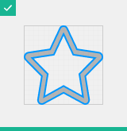

# Icon guidelines

An icon is required for each add-on that is submitted to the marketplace. This icon will be displayed within Squirrel – on the **Add-on menu**, **Canvas Objects list**, and on the **My Add-ons page**.

## Design considerations

Add-on icons should be designed to be simple, modern, friendly, and unique. Each add-on icon should be reduced to its minimal form, portraying only the essential features or concepts of the add-on.&#x20;

There are several ways to think about how to design your icon – Literal, Conceptual or Identifiable. Neither approach is right or wrong – it all depends on what works best for the specific add-on.

### Literal icons

You may want to show what your add-on looks like when in use, for example, a visual component such as a chart

### Conceptual icons

You may want to show the conceptual idea behind your add-on and portray what it does, rather than what it actually looks like

### Identifiable icons

You may want to use something recognisable, such as the brand mark or logo that your add-on functionality is built around

## Icon Specification

File type: **SVG**

Size: **16x16px**&#x20;

Colour: **Single colour**

Black **#000000**

## **Icon Size**

Add-on icons are displayed as 16x16 px. It is best to create icons at 100% scale for pixel-perfect accuracy.

|  | .png>) |
| ----------------------------------------------------- | ------------------------------------------------------------ |
| 100% scale                                            | 1000% scale                                                  |

|                                                                                |                                                       |
| --------------------------------------------------------------------------------------------------------------------------------- | ----------------------------------------------------------------------------------------------------------- |
| 
<mark style="color:green;"><strong>DO</strong></mark>  Ensure you use the full 16x16 space (or the max width or height)
 | 
<mark style="color:red;"><strong>DON’T</strong></mark> Don’t leave unnecessary space around icons
 |

## Icon Colour

Icons may end up being displayed in a different colour, depending on where it is used within Squirrel but it is only necessary to supply one version of your icon to us (we can re-colour it).

|                                                                             |                                                                                       |
| ------------------------------------------------------------------------------------------------------------------------------------- | --------------------------------------------------------------------------------------------------------------------------------------------- |
| 
<mark style="color:green;"><strong>DO</strong></mark> Use a single flat colour. We prefer to receive icons in black #000000
 | 
<mark style="color:green;"><strong>DO</strong></mark> Use a 25% fill opacity on some icon elements if a two-tone effect is required
 |

|                                                  |                                                   |
| ------------------------------------------------------------------------------------------------------------ | --------------------------------------------------------------------------------------------------------------- |
| 
<mark style="color:red;"><strong>DON’T</strong></mark> Don’t use multiple colours or gradients 
 | 
<mark style="color:red;"><strong>DON’T</strong></mark> Don’t include a background colour behind icons
 |

## Icon style

The icon will be displayed at a small size, and alongside many other icons. It’s important that your icon is legible and simple enough to decipher.

<table data-header-hidden><thead><tr><th></th><th></th><th data-hidden></th></tr></thead><tbody><tr><td></td><td></td><td></td></tr><tr><td><mark style="color:green;"><strong>DO</strong></mark> Simplify icons and shapes for greater clarity and legibility</td><td><mark style="color:red;"><strong>DON’T</strong></mark> Don’t make icons too complex or detailed </td><td></td></tr></tbody></table>

|                                          |                                                                                                             |
| -------------------------------------------------------------------------------------------------- | ---------------------------------------------------------------------------------------------------------------------------------------------------------------- |
| 
<mark style="color:green;"><strong>DO</strong></mark>

Make icons face forward  
 | 
<mark style="color:red;"><strong>DON’T</strong></mark>

Don’t make icons appear to be 
3-Dimensional (unless 3D is a specific feature of the add-on)
 |

|                                                                                                     |                                                                    |
| ---------------------------------------------------------------------------------------------------------------------------------------------------------- | -------------------------------------------------------------------------------------------------------------------------- |
| 
<mark style="color:green;"><strong>DO</strong></mark>

Ensure that line strokes are a consistent width. We recommend a line stroke of 1-1.5px.
 | 
<mark style="color:red;"><strong>DON’T</strong></mark>

Don’t use different line stroke widths in the icon 
 |

## Icon originality & copyright

Your icon will be used within the Squirrel product and will represent your add-on. Ideally, you will create the icon from scratch – original and free of any copyright.

|                                                                                                   |                                                                                                     |
| ----------------------------------------------------------------------------------------------------------------------------------------------------------- | ------------------------------------------------------------------------------------------------------------------------------------------------------------ |
| 
<mark style="color:green;"><strong>DO</strong></mark>

Ensure the icon is an original creation and is sufficiently different to other icons 
 | 
<mark style="color:green;"><strong>DO</strong></mark>

Ensure you have the rights to use any copyrighted icons or purchased appropriate licenses
 |

|                                                                                                                 |                                                                                      |
| ---------------------------------------------------------------------------------------------------------------------------------------------------------------------- | ---------------------------------------------------------------------------------------------------------------------------------------------- |
| 
<mark style="color:green;"><strong>DO</strong></mark>

Ensure any branded elements or logos are adhering to the relevant brand guidelines and restrictions
 | 
<mark style="color:red;"><strong>DON’T</strong></mark>

Don’t use the Squirrel logo, or any element of it as part of your icon 
 |

## Exporting your icon...

Your icon must be supplied in the correct way so that it will display properly. Here are some final things to check before you export your icon.

| .png>)                                                                                                             |                                                                                                         |
| ---------------------------------------------------------------------------------------------------------------------------------------------------------------------- | ------------------------------------------------------------------------------------------------------------------------------------------------------------------ |
| 
<mark style="color:orange;"><strong>CAUTION</strong></mark>

Watch out for any line strokes (especially corners) that may extend outside of the 16x16 size
 | 
<mark style="color:green;"><strong>DO</strong></mark>

Ensure that any line strokes or text have been converted to outlines before exporting as an SVG
 |

| .png>)                                                                                                           |                                                                                                                                               |
| ----------------------------------------------------------------------------------------------------------------------------------------------------------------------- | ---------------------------------------------------------------------------------------------------------------------------------------------------------------------------------------------------- |
| 
<mark style="color:green;"><strong>DO</strong></mark>

Ensure that your icon is exported at 16x16 even if the icon itself doesn’t fill the entire space 
 | 
<mark style="color:green;"><strong>DO</strong></mark>

Export your icon as an SVG (Scaleable Vector Graphic). This format can be scaled up or down without losing any of its resolution.
 |
