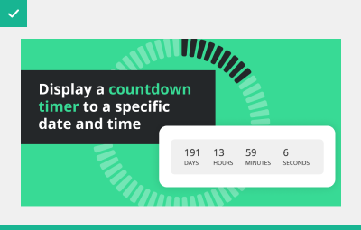

# Image guidelines

At least one image is required for each add-on that is submitted to the marketplace. The first image will become the feature image used in the **Marketplace**. It will also be used on the **Add-on Detail page** and the **My add-ons page**.

Additional images submitted will be displayed on the **Add-on detail page** only. These will be supportive images presented within a carousel.

.png>)

## Image specification

File type: **png, jpg, or gif**

Dimensions: **1200x627 px**&#x20;

Max file size: **2Mb**&#x20;

Colour: **RGB (sRGB IEC61966-2.1)**

## **Image Size**

Feature images are displayed at various sizes but always retain the same aspect ratio. All images should be submitted at the largest size of **1200x627 px**. It is best to create images at 100% scale for pixel-perfect accuracy, but bear in mind that the image will be scaled down - and therefore overall legibility needs to be considered.

### Images will be scaled down to various sizes...

<mark style="color:green;">**DO**</mark>\
Create all images at 1200 x 627. Submit as either a png, jpg or gif\

<mark style="color:red;">**DON’T**</mark>\
Don’t create your images at a smaller size and then scale up to the required size as this may result in a blurry or pixelated image\

## Feature image layout

This will be the first image that people see when browsing the marketplace and should give a good visual indication of what the add-on does, or looks like. We recommend that a title or short sentence also be included. The image should be designed to be eye-catching, persuasive, and unique. Be creative and try to represent the core features or concepts of the add-on, using either screenshots or illustrated graphics. In general the text should go on the left, and the image on the right. By following this recommended layout it will make it easier for users to browse the marketplace.

### Design considerations

<mark style="color:green;">**DO**</mark>\
Use a clean, simple, sans sarif font for your text. We recommend a font size of between 45-55 to ensure better legibility when displayed at smaller sizes.\

<mark style="color:red;">**DON’T**</mark>\
Don’t include too much text. The purpose of this text is to summarise what the key benefit of the add-on is, not to explain in detail what it does.\

<mark style="color:green;">**DO**</mark>\
Use vibrant colours in combination with text and graphics to make your imagery stand out and be as eye-catching as possible.\

<mark style="color:green;">**DO**</mark>\
Use real screenshots or visuals from the add-on itself\

<mark style="color:green;">**DO**</mark>\
Ensure the text has good visual contrast against the background. Consider using a solid colour behind the text and a bold typeface as this may help legibility.\

<mark style="color:green;">**DO**</mark>\
Check the image looks good at smaller sizes (as well as the large size). The smallest size (17%), doesn’t neccessarily need to be fully legible - only recognisable.\

<mark style="color:green;">**DO**</mark>\
Include the brand mark or logo that your add-on functionality is built around (e.g youtube/Lottiefiles). A brand logo should be positioned bottom left.\

<mark style="color:red;">**DON’T**</mark>\
Don’t include your own logo - this is not an advertising space for your own business.\

<mark style="color:green;">**DO**</mark>\
Ensure you have the rights to use any copyrighted images, icons, or illustrations. You are responsible for obtaining the appropriate licenses.\

<mark style="color:green;">**DO**</mark>\
Ensure any permitted branded elements or logos are adhering to the relevant brand guidelines and usage restrictions.\

## Additional images, animated gifs and videos

There is the option to submit up to 3 additional images to be displayed on the Add-on detail page only. These will be displayed in a carousel gallery. They don’t have to be static images. Each additional image slot could be:&#x20;

* Image (1200x627)
* Animated gif (1200x627)
* YouTube, Vimeo or Loom video (16:9)

It is not a requirement to fill these 3 additional image slots, but it might help to persuade users to try your add-on if they can see more visual examples of it. Images could focus more on feature details, showing examples of the add-on in use, screenshots, or even instructions or diagrams on how to use it.

### Dimensions

All images and animated gifs should be submitted at 1200x627.&#x20;

Videos can be any size as these will be scaled to fit in the viewport. However, we recommend you stick to the standard video aspect ratio of 16:9.

### Design considerations

There is no set layout recommendation for the additional images/videos/gifs as it will all depend on what needs to be shown. Be creative with your imagery and experiment to see what works best for your add-on. It is worth remembering that the additional images will only be shown on the Add-on Detail page, and so will be displayed at the larger size (80%) only.

<mark style="color:green;">**DO**</mark>\
Show large screenshots and real examples of what the add-on can do so users can see the details clearly.\

<mark style="color:red;">**DON’T**</mark>\
Don’t include long paragraphs of text in your image/video/animated gif. There is a dedicated area for text further down the add-on detail page.
